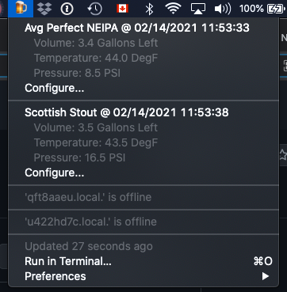

# kegerator
An ESP32-based controller for a kegerator

The controller adverstise itself with mDNS as `kegtor-XXXXXX.local.` where `XXXXXX` are the last 6 hexdecimal digits of its MAC address (to avoid conflicts with multiple controllers). You can browse to `http://kegtor-XXXXXX.local./` to get an minimal HTML UI.

I also have a [bitbar plugin](https://github.com/spouliot/bitbar-plugins/tree/main/flite) for macOS users.

In theory any software that works with Flite controllers ([display](https://www.flitesense.com/product-page/flite-display) or [headless](https://www.flitesense.com/product-page/flite-headless-controller)) should also work with this controller as long as it is possible to configure the URL to access the [REST API](https://www.flitesense.com/rest-api).
